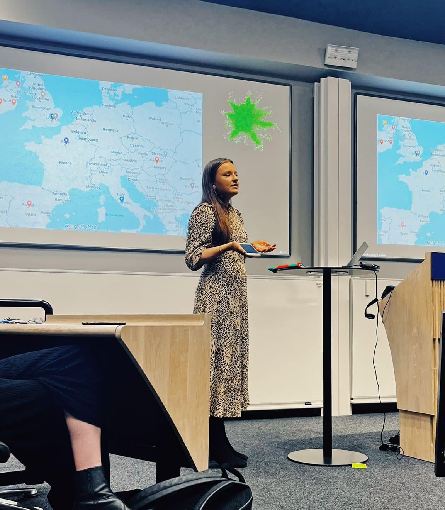
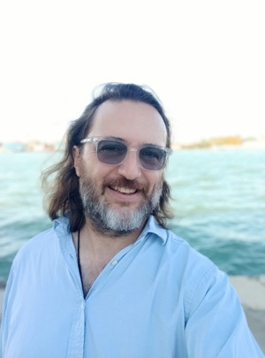

## Heather McRobie Allansdottir

Dr. Heather Allansdottir is an academic of law and writer focusing on the intersection of public international law and political tools and technologies. She holds a doctorate in law from Oxford University and has lectured on public international law and human rights law in Iceland, Australia, and the UK. Her current work examines space law and sustainability, as well as constitution-drafting experiences using new political tools.

## Ollie Bream McIntosh

Ollie Bream McIntosh is a researcher and designer working on sustainability transitions and collective intelligence. He is currently a Marie Curie Fellow pursuing a PhD on the use of platform technology and AI in governing sustainability transitions. His previous research has focused on human networks, digital technologies, and cross-sector sustainability programmes.

## Richard Kemp

Richard Kemp's main areas of interest include cultural evolution, coordination problems, spirituality, and optimism. He is particularly curious about recreating the positive effects of religious faith in a distributed way and reforming democracy to cope with an increasingly complex world. With a background in engineering and experience in financial services, Richard is comfortable with programming and enjoys various interests including fantasy, science fiction, and music.

## Paulina Wisdom

Paulina is a data analyst with degrees in Applied Mathematics and Data Analytics, transitioning into public health to apply behavioral science, data analysis, and game theory. She has facilitated community-building efforts as an Effective Altruism facilitator and led initiatives connecting students with non-profits. Paulina is passionate about generating positive change through technology, science, art, and community.

## Ilya Mouzykantskii

Ilya Mouzykantskii is the CEO of Civox, a startup building voice AI tools for political campaigns worldwide. A Stanford University CS graduate, he has held key roles at technology companies Telegram and Cardless. Ilya has a background in reporting, with his work published in major newspapers, and maintains an interest in open data and transparency.

## Claddagh NicLochlainn

Claddagh is the Parliamentary Lead for the Institute for the Future of Work, contributing to draft legislation on data protection and workers' rights. With masters degrees in public policy and computer science, she has worked in Parliament, startups, and as Head of Policy and Public Affairs for a human rights NGO. In her spare time, Claddagh volunteers with organizations focused on refugee rights and climate change advocacy.

## David Norton

David leads research, development, and innovation at Ekō, an organization mobilizing millions to hold corporations accountable. They have worked in Washington, D.C., Brussels, and London, previously serving as an official at the ITUC and in roles at various organizations. David studied sociology, political science, corpus linguistics, and gender studies, with a keen interest in how ideas and movements form and propagate online.

## Dorcas Nyamwaya

Dorcas is a governance specialist and researcher working at the intersection of digital technologies, democratic processes, and justice. Her current research focuses on the collaborative use of data sources and technologies to promote equity and solve global challenges. With a background in law, Dorcas has experience in urban development and is involved in various AI governance studies and initiatives.

## Alex Papadopoulos

Alex is a UX Researcher working on projects in the public sector and healthcare, aiming to make users' lives easier. They co-run a queer film festival and have a background in Psychology and Human-Computer Interaction. Alex's main interest is contributing to making the world better, and they engage in various creative pursuits including writing and theatre design.

## Tristan Spill

Tristan Spill is a London-based graphic designer specializing in UI/UX design and online branding. With a diverse background spanning movie poster creation and digital marketing for the music industry, he has worked for major clients like EMI, Viacom, and Disney. Recently, Tristan has shifted towards activism, consulting for scientists opposed to nuclear reactors and waste, and supporting causes like the Green Party and neurodiversity.

## Melissa Tranfield

Mel Tranfield is a software engineer dedicated to creating a better society through informed use of technology, education, and policy formation. She contributes to Campaign Lab, focusing on progressive technology and election tech tools, and is an organizer and coach for codebar, a charity enabling minority group members to learn programming. Mel is interested in discovering what well-designed political technology can achieve and contributing to building tools for accelerating social change.

## Casimir Jan Wanot

Casimir works as a software engineer for ExpressVPN and experiments with game development and meditation in his spare time. He is interested in large-scale human systems and how individual actions can influence them, with an enduring interest in AI safety. Casimir practices a long-term meditation practice called Global Wayfinding and writes about various topics including spirituality and AI alignment on his blog.

## Simon Wisdom

Simon combines analytical thinking with creative experimentation, having studied Business and worked as a Data Scientist in fintech. He is currently focused on AI, considering whether to pursue technical alignment, governance and policy, or something in between. Simon enjoys tinkering with various creative projects and facilitates connection workshops at festivals and in the workplace.

## Yung-Hsuan Wu

Yung-Hsuan holds a Master's in International Affairs and has worked on digital policymaking in the Geneva-based diplomatic and UN ecosystem. He has developed a keen interest in AI studies through research experiences in AI policy and governance. Yung-Hsuan approaches AI from a sociological/anthropological perspective, aiming to unentangle the complex ties between society and technology.