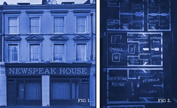

What if Newspeak House could actively communicate with us or make decisions?
What does an "autonomous house” mean? How would it interact with people or itself?

If this interests you and you want to explore these questions, sign up below and we'll be in touch:
<form action="https://formspree.io/f/mpwzenql" method="POST">
    

        <input
            type="email"
            name="email"
            placeholder="Your email"
            required
            style="padding: 8px; width: 200px; margin-right: 8px;"
        >
        <button type="submit" style="padding: 8px 16px;">
            Subscribe
        </button>
    

</form>

